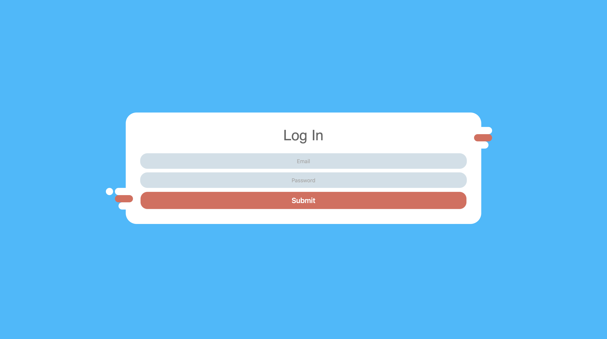
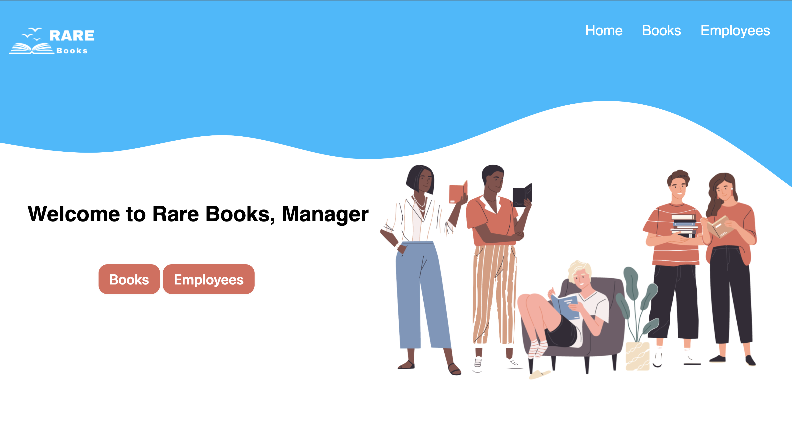
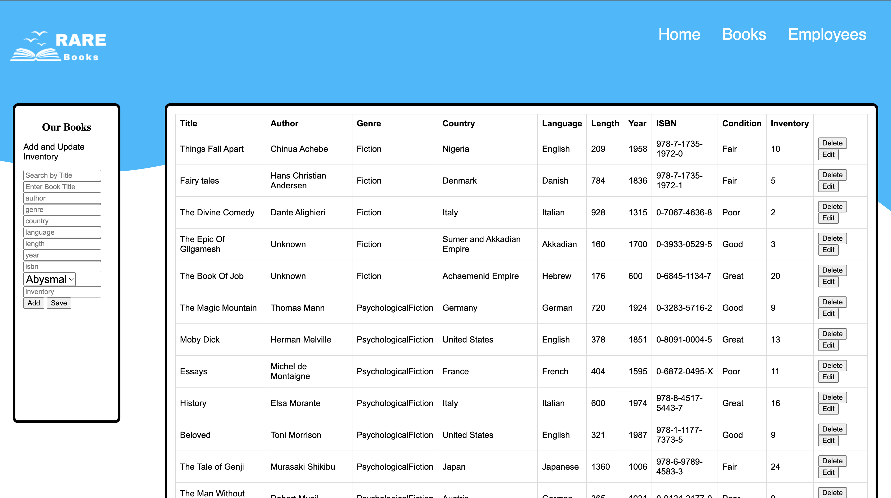
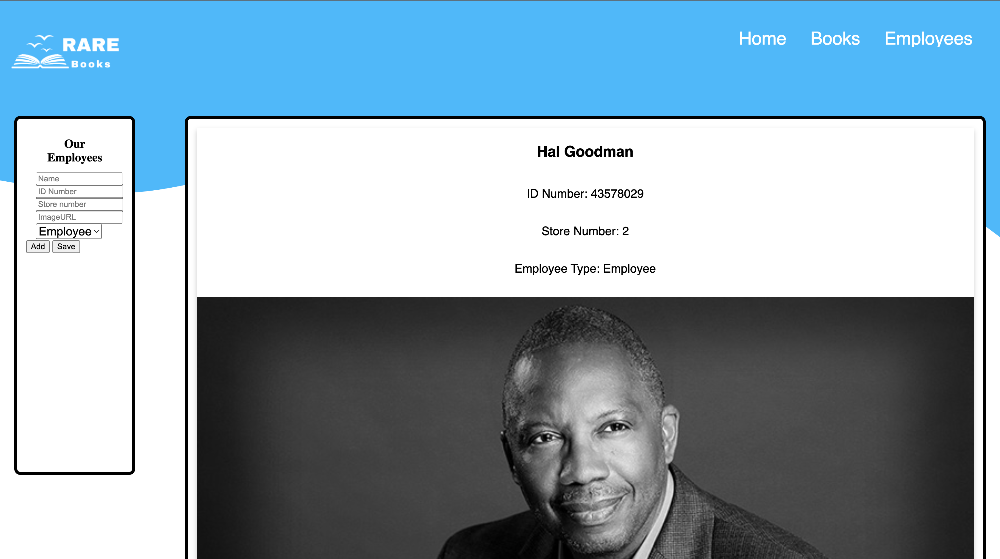

# Rare Books - Inventory Solution

This is a solution a business, Rare Books, that needed a way of viewing their inventory and tracking their inventory. 

## Table of contents

- [Overview](#overview)
  - [The challenge](#the-challenge)
  - [Screenshot](#screenshot)
  - [Links](#links)
- [My process](#my-process)
  - [Built with](#built-with)
  - [What I learned](#what-i-learned)
  - [Continued development](#continued-development)
  - [Useful resources](#useful-resources)
- [Author](#author)
- [Acknowledgments](#acknowledgments)

**Note: Delete this note and update the table of contents based on what sections you keep.**

## Overview

### The challenge

Users should be able to:

- View the optimal layout depending on their device's screen size
- See hover states for interactive elements

### Log In

- Manager - Email: manager@rarebooks.com; Password: 12345
- Employee - Email: employee@rarebooks.com; Password: 67890

### Screenshot







### Links

- Solution URL: [Add solution URL here](https://github.com/ebukaohiomoba/rare-bookstore-app)
- Live Site URL: [Add live site URL here](https://ebukaohiomoba.github.io/rare-bookstore-app/)

## My process

### Built with

- Javascript ES6
- CSS custom properties
- Flexbox
- CRUD operations
- Semantic HTML5 markup


### What I learned

Use this section to recap over some of your major learnings while working through this project. Writing these out and providing code samples of areas you want to highlight is a great way to reinforce your own knowledge.


```html
<h1>Some HTML code I'm proud of</h1>
```
```css
.proud-of-this-css {
  color: papayawhip;
}
```
```js
const proudOfThisFunc = () => {
  console.log('🎉')
}
```


### Continued development

My next step is to transform this project into a React app. The objectives would remain the same as well as the final product, but it will be built using React. Furthermore, as I grow comforatble with making API calls, I will be linking the book and employee tables to databases where the tables will be populated by a database. 

### Useful resources

- [Example resource 1](https://www.freecodecamp.org/news/a-step-by-step-guide-to-getting-started-with-html-tables-7f43b18f962b/) - This helped me with HTML tables with providing a good baseline 

## Author

- Twitter - [@eohiomoba](https://www.twitter.com/eohiomoba)


## Acknowledgments

I would like to thank the amazing TechBridge program including the instructors and the teaching assistants that provided help and mentorship for me as I put this project together. This has been a long journey to getting this project ready, and I am thankful to my TechBridge community for providing me with guidance throughout the program. 
